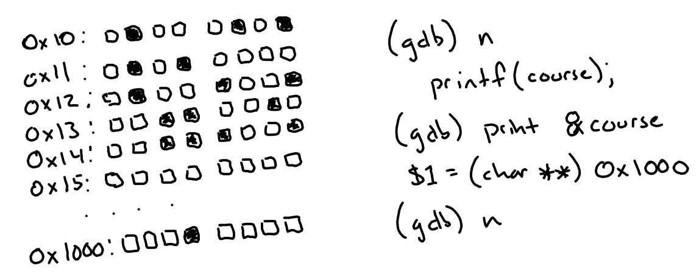

# UCSD CSE29 Summer Session 1 Syllabus and Logistics

- [Olivia Weng](https://www.oliviaweng.com/) (Instructor)
- [Joe Gibbs Politz](https://jpolitz.github.io) (Instructor)

CSE29 introduces you to systems programming: 1) the basics of how programs
execute on a computer, 2) programming in C with direct access to memory and
system calls, 3) software tools to manage and interact with code and programs.

##  Basics

- Lecture
    - Section A (Joe): Tue/Thu 11am-1:50pm on Zoom (link on Canvas)
    - Section B (Olivia): Mon/Tue/Wed/Thu 11am-12:20pm in [CSB (Cognitive Science Building)](https://map.concept3d.com/?id=1005#!m/237176?share) 004
- Labs
    - Section A (Joe): Wed 10am-1:50pm (link on Canvas)
    - Section B (Olivia): Wed 2pm-5:50pm in [CSE](https://map.concept3d.com/?id=1005#!m/164780?share) B250
- Exams and final exam: See [exams](#exams) below
- Professor office hours: TBD
- Office hours: TBD
- Q&A forum: [Piazza](https://piazza.com/class/mc9db96ku3v39f/)
- Textbook/readings:
  - Required (and free): [Dive Into Systems](https://diveintosystems.org/book/), plus additional readings we will assign (all free/online)
  - Recommended/helpful (and free): [MIT Missing Semester](https://missing.csail.mit.edu/)
  - Not free but pretty cheap: [Julia Evans Zines](https://wizardzines.com/), especially [The Pocket Guide to Debugging](https://wizardzines.com/zines/debugging-guide/)

## Course Components

There are several components to the course:

- **Problem Sets**
- **Lab sessions**
- **Exams**
- **Lecture sessions**

### Problem Sets

In weeks 2, 3, 4, and 5 there will be a _problem set_ due before lab. These will
be hosted on PrairieLearn and consist mostly of small, self-contained
programming problems for you to complete.

These serve a few purposes:

1. They are practice for you. Developing small programs from scratch is not just
conceptually important, it is important for your eyes, fingers, and brain to
learn to coordinate on common patterns in writing and running code.
2. They will be integral parts of lab. In week 2-4 we will use some of the
solutions to the problem sets as building blocks for the programs we create in
lab.
3. They are practice for the exams, both in content and format. The exams in
this course will focus on writing programs and using software tools in a
controlled environment, and that environment is shared between the problem sets
and exams.

### Lab Sessions

The course's lab component meets for 4 hours. In each lab you'll switch between
working on your own, working in pairs, and participating in group discussions
about your approach, lessons learned, programming problems, and so on.

Each lab has a dual theme:

- Combining small functions and programs from the week's practice into a larger
  application
- Learning development tools and techniques for managing, debugging, and
  testing your codebases

The lab sessions and groups will be led by TAs and tutors, who will note your
participation in these discussions for credit. Note that you must
**participate**, not merely **attend**, for credit. You will get a score of 0,
1, 2, or 3 at the end of each lab based on you and your group's participation
and completion of the lab activities.

If you miss lab, you'll still be held accountable for understanding the
relevant material via Exams and Assignments. You can miss one lab without it
impacting your grade (see [Grading](#grading) below). There is no way to make
up a lab, even for illness, travel, or emergencies. My preference would be to
require all 5 labs for an A, and have some kind of excused absences. However,
tracking excused absences doesn't really scale, so the “one for any reason”
policy is how we handle it. You don't need to justify your missed labs. Contact
the instructor if you'll miss more than 1 lab for unavoidable reasons.

### Exams

The exams will be administered through
[PrairieLearn](https://www.prairielearn.com/about) and be similar in format to
the problem sets.

There are 3 exams during the quarter in weeks 2-4. On each you'll get a **Full
Pass** (2 points), **Partial Pass** (1 point), or
**Try Again** (0 points) as your score.

We don't have a traditionally-scheduled final exam for this course (you can
ignore the block provided in Webreg).  Instead, in the last few days of the
summer session, you'll have the opportunity to retake **up to two** of the exams
from during the quarter to improve your score up to a **Full Pass** regardless
of the score on the first attempt. The questions on the retakes may be different
than the original exam, but will test the same learning outcomes. This is also
the only make-up option for missed exams during the quarter: if you miss an exam
for any reason it will be scored as 0, and you can use one of your retake
opportunities on that exam.

For the in-person section, exams will be proctored through the [Triton Testing
Center CBTF](https://tritontesting.ucsd.edu/cbtf/index.html). For the remote
section, your exams will be proctored on Zoom. Detailed instructions will come
before the week 2 exam. For remote exams, you should make sure you have _two_
devices available: one that can be logged into Zoom with a camera pointed at
your physical workspace (this can be a phone or tablet), and one that you will
use to complete the exam.

### Lecture Sessions

Lecture sessions will be a mix of presenting content, Q&A, and time for you to
work alone or in groups on problems from problem sets with follow-up Q&A.

Participation will be graded (see [Grading](#grading) below). Actual
participation activities may vary from session to session, and may include:

- Submitting something on PrairieLearn that we worked on in the lecture session
- Submitting something in the live Zoom chat or similar Q&A tool
- Answering a question/making a contribution when called on/at some point during
a session

## Grading

The three main course components have achievement levels to get an A, B, or C in
the course. You must reach that achievement level in _all_ of the categories to
get an A, B, or C.

- **A** achievement:
    - 11 lab points (3 possible per lab across 5 labs)
    - 10 problem set points (3 possible per problem set across 4 weeks)
    - 5 total exam points (2 possible per exam across 3 exams)
- **B** achievement:
    - 9 lab points
    - 8 problem set points
    - 4 total exam points
- **C** achievement:
    - 7 lab points
    - 6 problem set points
    - 3 total exam points

Lecture participation impacts your grade seaprately. First, calculate your
letter grade from above. Then apply:

- `+` grade modifier: 9-10 lectures (A section), 13-15 lectures (B section)
- no grade modifier: 7-8 lectures (A section), 10-12 lectures (B section)
- `-` grade modifier: 5-6 lectures (A section), 7-9 lectures (B section)
- One letter grade lower: 0-4 lectures (A section), 0-6 lectures (B section)

We may also make decisions about +/- modifiers around the boundaries of the
grade categories. This will be done at the end of the quarter at instructor
discretion, and will be consistent across all students.

Requests to change this grading policy (for a specific student or class-wide)
will be denied with a link to this syllabus section. Consider this: we may, as
instructors, decide for academic reasons that the most accurate way of assigning
letter grades in the class needs to change (and we tend to only make changes
that improve letter grades relative to this starting policy). However, it would
be inappropriate for us to do so in response to student requests: that could
create an appearance that we give students the grades they ask for rather than
the grades they earned.

- A+ grade example:
    - Lab scores: 1, 3, 2, 3, 2 (11)
    - Problem set scores: 3, 3, 2, 3, 3 (14)
    - Exam scores: 2, 2, 1 (5)
    - Lecture participation: 9 (in A section)
- B+ grade example:
    - Lab scores: 2, 2, 2, 2, 1 (9)
    - Problem set scores: 3, 3, 3, 3, 3 (15) 
    - Exam scores: 2, 1, 1 (4)
    - Lecture participation: 13 (in B section)
- C- grade example:
    - Lab scores: 3, 2, 3, 2, 0 (10)
    - Problem set scores: 1, 2, 3, 3, 3 (12) 
    - Exam scores: 1, 1, 1 (3)
    - Lecture participation: 7 (in B section)
- F grade example:
    - Lab scores: 2, 2, 2, 2, 1 (9)
    - Problem set scores: 3, 3, 3, 3, 3 (15) 
    - Exam scores: 1, 0, 1 (2)
    - Lecture participation: 5 (in A section)

## Policies

Individual assignments describe policies specific to the assignment. Some
general policies for the course are here.

## FAQ/AFQ (Anticipated Frequent Questions)

**Q: Is the course remote?**

There are two offerings of the course. The one taught by Joseph (Joe) Gibbs
Politz is remote. The one taught by Olivia Weng (listed as “Staff” as of
writing this FAQ) is in-person. The course content is essentially the same: we
will share materials (and this website!).

**Q: Will the content differ across the sections?**

The assignments, lab content, and exams will be the same or equivalent across
the sections. Lectures will differ in style according to modality and
instructor but follow the same content. The only formal difference is modality
(in-person vs. remote), not content.

**Q: Will the in-person section actually be partially or fully remote even
though it doesn't say so?**

No. You **must plan to be available for the in-person components** to pass the
class for the in-person section.

**Q: Is Joe's section fully remote?**

Yes, the course is fully remote, including lectures, labs, and exams.

**Q: Can I complete the remote course from XYZ state/country/timezone?**

We don't check or verify that all services are available outside of the US (for
example, but not exclusively [PrairieLearn](https://www.prairielearn.com),
[Gradescope](https://piazza.com), remote access to USCD via `ssh`, sharing
videos on Youtube and Google Drive), so wherever you are you're responsible for
making sure you have access to these services.  Sometimes we decide somewhat
late exactly what services we will use, and we only test them from campus/from
California.  Some aspects of accessing UCSD from outside the country may
require extra steps that are your responsibility, and we won't necessarily be
able to help or come up with workarounds if something doesn't work.

Also, some course components, while remote, require **synchronous**
participation. So you need to be available, with a quality Zoom connection, for
the listed course times.

**Q: What equipment/setup do I need for the remote course?**

Most remote activities will be done over Zoom, often while using another tool
like a programming environment or [PrairieLearn](https://www.prairielearn.com).

You need a camera and a microphone so that you can participate in discussions.
You should have a setup with a good enough Zoom connection to support
screenshare and sharing your webcam; group activities in lab and lecture may
require that you work in groups and cameras will be expected to be on to
facilitate high-quality discussion.

**Q: Is there a syllabus listing the topics covered in this course that I can
show my department/school/institution?**

Yes, the content will be similar to the Fall 2024 version:
[https://ucsd-cse29.github.io/fa24/](https://ucsd-cse29.github.io/fa24/), and
that page has the relevant course outcome and syllabus information.

**Q: I am waitlisted for one of the sections at position N. What should I do?**

Come to class and do all the work as usual (you will have Canvas access to get
all the needed links) so you can be up to speed if you do get a spot. This is
aligned with [official department
policy](https://cse.ucsd.edu/undergraduate/spring-2025-undergraduate-course-updates#LateAddPolicy).

We can't make accurate predictions about chances of getting into the course
from a specific waitlist position, or control that process as instructors.

As of early June, there are plenty of available spots in the in-person section!

